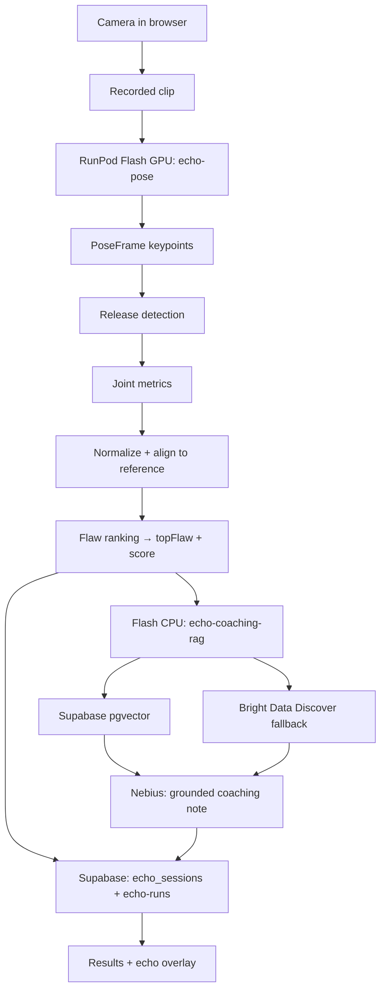

# Echo at Scale — Architecture

## 1. Problem

Most players can't see their own jump shot. The flaw — a flying elbow, a guide
hand that pushes, a dip that's too shallow — lives in a view you never get to
watch. Echo recreates the coach's eye: it films one shot, finds the single
biggest form flaw, shows the gap against a reference pose, and hands back one
cited drill plus a generated coaching note. **"At Scale"** means the heavy step
— pose estimation — runs on fanned-out GPU workers, not the phone.

## 2. Layers

| Layer | Platform | What runs here | Construct |
|-------|----------|----------------|-----------|
| **Compute / serving** | **RunPod Flash** | GPU pose, CPU RAG, CPU ingestion, parallel fan-out | `@Endpoint(gpu=GpuType.NVIDIA_GEFORCE_RTX_4090, …)` / `@Endpoint(cpu=…)`; `flash dev` locally, `flash deploy` for production |
| **Web data / retrieval** | **Bright Data** | Fetch drill + technique content to seed and refresh the coaching corpus | `brightdata-sdk` — `BrightDataClient.discover()` |
| **Backend** | **Supabase** | Auth, Postgres session history, **pgvector** coaching store, object storage | `@supabase/supabase-js` + `@supabase/ssr`; RLS on `auth.uid()` |
| **Coaching LLM** | **Nebius** | Writes the grounded coaching note from retrieved sources + measured numbers | OpenAI-compatible Token Factory endpoint |
| **App** | **Next.js** | Capture UI, echo-overlay canvas, results, ranked report, history | App Router, Server Actions, Route Handlers |

### RunPod Flash endpoints

| File | Endpoint name | Role |
|------|---------------|------|
| `flash/pose_endpoint.py` | `echo-pose` | GPU RTMPose — clip in, per-frame keypoints out |
| `flash/scoring.py` | (library) | Form scoring ported from TypeScript |
| `flash/orchestrate.py` | (script) | Fan-out N clips via `asyncio.gather`, ranked report |
| `flash/ingest_coaching.py` | `echo-coaching-ingest` | Bright Data → embeddings → Supabase pgvector |
| `flash/coaching_rag.py` | `echo-coaching-rag` | pgvector retrieval + Bright Data live fallback |
| `flash/hello_gpu.py` | `echo-hello-gpu` | GPU smoke test |

RTMPose weights cache on NetworkVolume `echo-rtmpose-cache` (`HOME=/runpod-volume`).

## 3. Component → layer map

### App (Next.js)

| Path | Layer | Notes |
|------|-------|-------|
| `src/components/capture/**`, `src/lib/vision/**` | App | Client capture + live preview skeleton; browser pose is fallback only |
| `src/app/api/analyze/route.ts` | App → Flash | Posts clip to `echo-pose`; falls back to browser keypoints |
| `src/lib/flash/client.ts` | App → Flash | HTTP client for pose + RAG endpoints |
| `src/lib/analysis/**` | Pure TS | Release detection, metrics, normalize/align, flaw ranking, scoring |
| `src/components/overlay/**` | App | Form-vs-echo canvas; renders `AnalysisResult.echoRef` |
| `src/lib/coach/**` | App → Flash → Supabase | `retrieval.ts` calls Flash RAG; `nebius.ts` generates note; `curated.ts` offline fallback |
| `src/lib/db/**` | App → Supabase | `echo_sessions` CRUD, `echo-runs` uploads, local-demo fallback |
| `src/app/auth/**` | App → Supabase | Email/password auth, session cookies |
| `src/app/report/**` | App | Ranked fan-out report + cost panel + save to Supabase |
| `src/lib/contracts.ts` | Shared contract | Zod schemas both halves build against — **do not change casually** |

### Shared contract (frozen)

`ShotCapture` → `AnalysisResult` (includes `echoRef`) → `CoachingResult`. Fan-out
report adds `RankRep.dimensions`, `TimelineEntry`, and `RankCost` observability
fields. See `src/lib/sample-report.ts` for the reference shape.

## 4. Supabase schema

### `echo_sessions`

Player session history. RLS: users read/insert their own rows (`user_id = auth.uid()`).

| Column | Type | Purpose |
|--------|------|---------|
| `id` | uuid | Primary key |
| `user_id` | uuid | FK → `auth.users` |
| `score` | float | 0–100 overall score |
| `top_flaw_*` | text | Worst flaw id, label, severity |
| `metrics` | jsonb | `JointMetrics` from analysis |
| `coaching` | jsonb | `CoachingResult` |
| `report` | jsonb | Full fan-out `CoachedReport` (optional) |
| `clip_*`, `keypoints_*`, `report_*` | text | Storage URLs/keys for artifacts |
| `created_at` | timestamptz | Session timestamp |

Migrations: `src/lib/db/migrations/001_echo_sessions.sql`, `migrations/20260630205449_add-run-artifacts.sql`.

### `coaching_documents`

pgvector corpus for RAG. Populated by `flash/ingest_coaching.py`. RLS revoked
from `authenticated` — only service-role / Flash workers read/write.

Migration: `migrations/20260630200845_create-coaching-documents.sql`.

RPC: `match_coaching_documents(query_embedding, match_count, …)` — cosine
similarity search with optional flaw-label filter.

### Storage: `echo-runs`

Private bucket. Path pattern: `{user_id}/{run_id}/clip.webm`, `keypoints.json`,
`report.json`. RLS policies scope objects to `uploaded_by = auth.jwt() ->> 'sub'`.

## 5. Coaching retrieval flow

`src/lib/coach/retrieval.ts` calls the Flash RAG endpoint when
`RUNPOD_FLASH_BASE_URL` (or dev localhost) is configured. The RAG worker
queries `coaching_documents` first; on weak/no match it runs a live Bright Data
Discover query and grounds the drill in fresh cited results.

`coachFlaw` falls back to `curated.ts` on any live failure so the demo never
blanks.

## 6. Fan-out (batch) flow

`flash/orchestrate.py` dispatches N clips to `echo-pose` in parallel
(`asyncio.gather`), scores each rep locally (`flash/scoring.py`), ranks worst
first, and optionally enriches with RAG drills. The ranked report lands in
`/report` and can be persisted to `echo_sessions.report`.

## 7. Key decisions

- **Pose on Flash, not the browser.** Server-side GPU pose is the compute story.
  The endpoint emits the existing keypoint schema so analysis and overlay code
  are reused, not rewritten.
- **Supabase as the single backend.** Auth, Postgres, pgvector, and Storage all run on one Supabase
  project. Flash workers connect via service-role
  credentials (`SUPABASE_SERVICE_ROLE_KEY` + `SUPABASE_URL`).
- **Directional, reference-based feedback** — not absolute biomechanical
  precision. A 2D estimate measures angles in the image plane; we compare
  against a reference and report flaws directionally.
- **Retrieval-grounded coaching.** Bright Data retrieves; Nebius generates. The
  note may not introduce facts absent from what was retrieved.
- **Graceful fallback everywhere.** No Flash → browser pose. No RAG → curated
  drills. No Nebius → deterministic template note. No Supabase keys → local-demo
  storage.

## 8. Environment variables (by consumer)

| Variable | Consumer |
|----------|----------|
| `NEXT_PUBLIC_SUPABASE_URL`, `NEXT_PUBLIC_SUPABASE_ANON_KEY` | Next.js client + SSR auth |
| `SUPABASE_SERVICE_ROLE_KEY` | Server Actions (storage upload, bypass RLS for admin ops) |
| `RUNPOD_API_KEY`, `RUNPOD_FLASH_BASE_URL` | Next.js → Flash HTTP |
| `NEBIUS_API_KEY` | Next.js coaching note generation |
| `BRIGHTDATA_API_TOKEN`, `OPENROUTER_API_KEY`, `SUPABASE_*` | Flash workers (ingest + RAG) |

Never commit real keys. Client-exposed vars must be prefixed `NEXT_PUBLIC_`.
