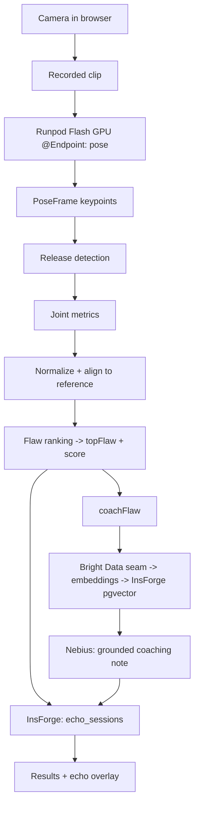

# Echo at Scale — Architecture

## 1. Problem

Most players can't see their own jump shot. The flaw — a flying elbow, a guide
hand that pushes, a dip that's too shallow — lives in a view you never get to
watch. Echo recreates the coach's eye: it films one shot, finds the single
biggest form flaw, shows the gap against a reference pose, and hands back one
cited drill plus a generated coaching note. **"At Scale"** means the heavy step
— pose estimation — runs on fanned-out GPU workers, not the phone.

## 2. Layers

| Layer | Platform | What runs here | Construct |
|-------|----------|----------------|-----------|
| **Compute / serving** | **Runpod Flash** | Pose estimation (and other compute-heavy work) as serverless GPU/CPU endpoints; fan-out across clips | `@Endpoint(gpu=GpuType.NVIDIA_GEFORCE_RTX_4090, dependencies=[...])` on async funcs; `flash dev` to test, `flash deploy` to ship |
| **Web data / retrieval** | **Bright Data** | Fetch drill + technique content to seed and refresh the coaching corpus | Discover API + pre-built scrapers + Web Unlocker via `brightdata-sdk` |
| **Backend** | **InsForge** | Auth, Postgres session history, **pgvector** coaching store, S3-style storage | `@insforge/sdk` (auth/db), pgvector tables |
| **Coaching LLM** | **Nebius** | Writes the grounded coaching note from retrieved sources + measured numbers | OpenAI-compatible Token Factory endpoint |
| **App** | **Next.js** | Capture UI, echo-overlay canvas, results, history | App Router, Server Actions |

## 3. Component → layer map

- `src/components/capture/**`, `src/lib/vision/**` — client capture + live preview skeleton. **App.** Pose moves to Flash (below); client pose stays as a fallback only.
- **Pose endpoint** (Prompt A) — server-side GPU pose on **Runpod Flash**. Input: one clip. Output: per-frame keypoints in the existing `PoseFrame`/`Keypoint` schema (`src/lib/contracts.ts`), keyed by MediaPipe landmark **name** so the analysis + overlay consumers are unchanged.
- `src/lib/analysis/**` — release detection, metric extraction, normalize/align, flaw ranking, scoring. **Pure TS, layer-agnostic.** Consumes keypoints from the Flash endpoint.
- `src/components/overlay/**` — the form-vs-echo canvas. Renders from `AnalysisResult.echoRef`. Unchanged.
- `src/lib/coach/**` — the coaching chain. Retrieval is the **Bright Data seam** (§4); generation is **Nebius**; `curated.ts` is the offline fallback.
- `src/lib/db/**`, `src/app/auth/**`, `src/app/api/auth/**`, `src/proxy.ts` — **InsForge** auth + the `echo_sessions` table (RLS scoped to `auth.uid()`). pgvector tables for the coaching store are added in Prompt B.

## 4. The Bright Data retrieval seam

The coaching RAG used to fetch web content with a hosted web-search API. That
fetch is removed. The retrieval **interface** is intact in
`src/lib/coach/retrieval.ts` (`retrieveDrill`, `retrieveSources`,
`hasLiveRetrieval`), with the data-source wiring stubbed:

```
# TODO: Bright Data fetch -> embeddings -> Insforge pgvector (Prompt B, Phase 1)
```

`coachFlaw` calls the seam when `hasLiveRetrieval()` is true; until Prompt B
wires Bright Data → embeddings → InsForge pgvector, it returns `false` and the
chain falls back to the curated drill DB. Nothing downstream (the Nebius note,
the UI references list) changes when the seam goes live — only the source of the
drill and supporting links.



## 5. Key decisions

- **Pose on Flash, not the browser.** Server-side GPU pose is the project's
  compute story and the thing that scales past one device. The Flash endpoint
  emits the existing keypoint schema so the analysis and overlay code is reused,
  not rewritten.
- **Directional, reference-based feedback** — not absolute biomechanical
  precision. A 2D estimate measures angles in the image plane; we compare
  against a reference and report flaws directionally.
- **Retrieval-grounded coaching.** Bright Data retrieves; Nebius generates. The
  note may not introduce facts absent from what was retrieved.
- **Graceful fallback everywhere.** No Flash → client pose. No Bright Data →
  curated drills. No Nebius → deterministic template note. The demo never blanks.
